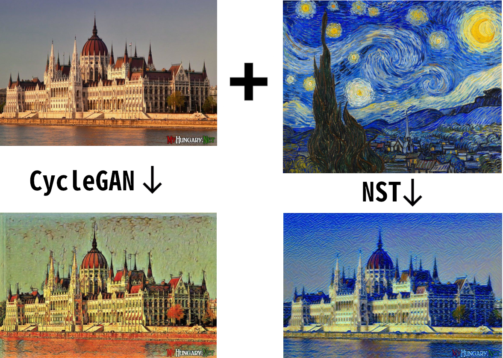

# TelegramStyleBot

### Как найти и протестировать бот?
__Ссылка на бота: https://t.me/StyleImageBot__  
Автор бота: @JwDaKing (stepik id: 157045965)  
Пожалуйста, заранее согласуйте время тестирования бота с автором (т.к. для хостинга моделей
используются платные инстансы AWS). Спасибо!   

### Зачем нужен этот бот?
Этот Telegram бот способен применить стиль одной картинки к другой с помощью Neural Style Transfer
или преобразовать картинку с помощью предобученных CycleGAN моделей. 
 
_Пример работы бота:_

### Архитектура бота
Бот хостится на AWS, используя SAM (Serverless Application Model),
которая позволяет объеденить многие компоненты бота в одном месте.
Большинсто ресурсов бота описано в файле template.yaml:

* ApiGateway - принимает запрос от Telegram и передаёт его функции. 
* Lambda-функция MsgHandler - обрабатывает сообщения от бота. Для работы бота
напрямую используется Telegram Bot Api, то есть все запросы посылаются на Telegram
через библиотеку requests. 
* DynamoDB ImageIdTable - динамическая база данных (не SQL), которая сохраняет
file_id content картинки от пользователя.
* SageMaker Endpoint - место для хостинга NST и CycleGAN моделей, которые вызывает lambda
функция.

##### Принцип работы
При старте бот просит отправить ему контент-картинку. После отправки и проверки картинки бот
сохраняет её file_id в таблицу по ключу user_id. Затем, когда в таблице есть строчка с данным user_id
бот понимает, что сейчас пользователь должен скинуть ему стиль-картинку или выбрать установленный стиль на
клавиатуре. После принятия стиль-картинки, бот вызывает соответствующую модель из SageMaker, передавая в неё нужные аргументы. На время
обработки картинки для имитации загрузки бот отправляет стикер с загружающимся утёнком и сохраняет message_id
этого сообщения в таблицу, чтобы затем удалить стикер. После обработки картинки, SageMaker модель отправляет обработанную картинку пользователю,
удаляет загружающийся стикер и строчку с пользователем из таблицы. Теперь бот готов принимать новую контент-картинку.  
При этом бот имеет надёжную "защиту от дурака", то есть он проверяет каждое сообщение на правильность и подсказывает пользователю
в случае неправильного ввода.

_Ниже приведена графическая схема архитектуры бота:_  

### Архитектура моделей
Код моделей находится в папке SageMaker. Каждая модель написана на PyTorch.
В каждой директории находится главный файл inference.py, который содержит функции 
model_fn, input_fn, predict_fn, output_fn, необходимые для работы SageMaker, остальные
же файлы отвечают за сами алгоритмы.
##### Neural Style Transfer (NST)
Основа кода взята отсюда: https://pytorch.org/tutorials/advanced/neural_style_tutorial.html  
__Изменено мной:__
* Переформатирован код для более удобной работы
* Добавлена функция изменения разрешения входных изображений
* Прочие мелкие изменения для упрощения кода и оптимизации работы
##### CycleGAN
Основа кода взята отсюда: https://github.com/junyanz/pytorch-CycleGAN-and-pix2pix  
__Изменено мной:__
* Переформатирован код для более удобной работы
* Удалены лишние файлы
* Из всех доступных моделей одна обучена мной (winter2summer), остальные скачаны
* Более удобная функция изменения разрешения входного изображения
* Прочие мелкие изменения для упрощения кода и оптимизации работы

